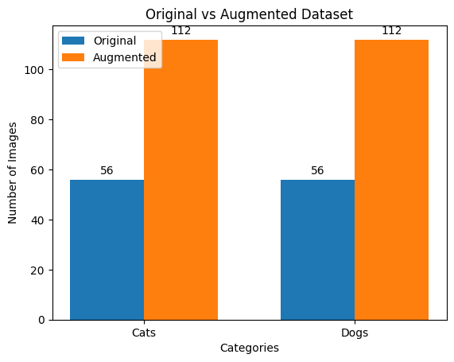
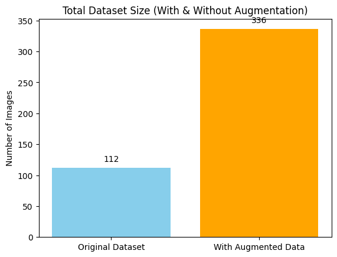
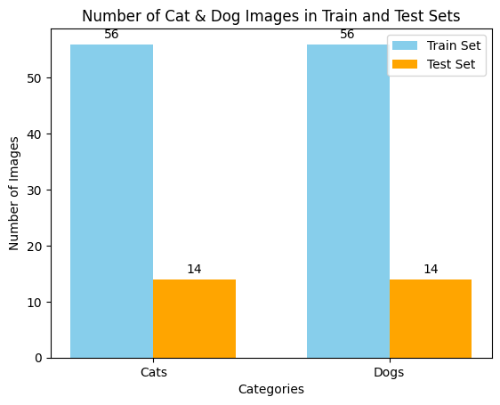
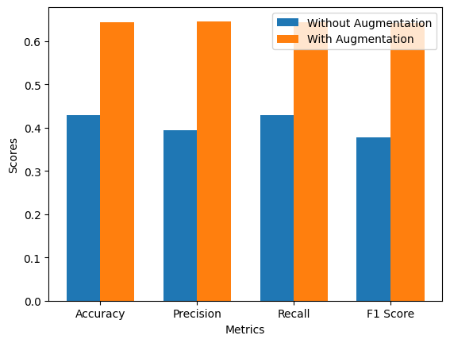
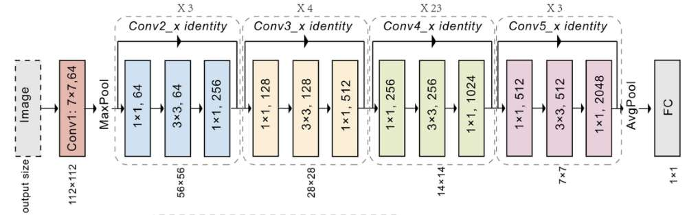

# **Lab 05: Data Augmentation & Image Classification**  
**CS 203: Software Tools & Techniques for AI**  
**IIT Gandhinagar | Sem-II, 2024-25**

**Team Members**
- Nishchay Bhutoria (23110222)
- Srivaths P (23110321)

## **Objective**  
Apply data augmentation techniques to improve the performance of an image classification model distinguishing between cats and dogs.

---

## **Task 1: Data Augmentation**

### **Steps:**  
1. **Dataset Download:**  
   - Downloaded the [Cats & Dogs Test Dataset](https://www.kaggle.com/datasets/samuelcortinhas/cats-and-dogs-image-classification?select=test).

2. **Train-Test Split (80:20):**  
   - Split using `make_split.py` with `train_test_split` from `sklearn`.

3. **Data Augmentation (Using Augly):**  
   - Created a custom function applying **3 random augmentations** (from 10) per image.
   - **Augmentations used:** blur, color jitter, contrast, horizontal flip, vertical flip, rotate, sharpen, change aspect ratio, crop, scale.
   - Augmented images: **2x the train set size**.

4. **Statistics of Dataset:**  
   - Displayed counts for original and augmented datasets.
   - Ensured balanced distribution of cat and dog images in both train and test sets.

### **Bar Graphs:**
- Original vs Augmented Dataset Counts.
- Total Dataset Size (With & Without Augmentation).
- Number of Cat & Dog Images in Train and Test Sets.




---

## **Task 2: Model Training**

### **Model Setup:**
- **Model:** `microsoft/resnet-50` (from Hugging Face).
- **Weights:** Initialized from scratch (no pre-trained weights).
- **Loss Function:** CrossEntropyLoss.
- **Optimizer:** Adam, learning rate = 0.001.

### **Training Process:**
1. **Without Augmentation:**  
   - Trained on original dataset for **15 epochs**.

2. **With Augmentation:**  
   - Trained on augmented dataset for **15 epochs**.

### **Evaluation Metrics:**
- **Accuracy**, **Precision**, **Recall**, and **F1 Score** computed on the test set.
- Metrics calculated using `sklearn.metrics`.

### **Results:**

| **Metric**     | **Without Augmentation** | **With Augmentation** |
|----------------|--------------------------|-----------------------|
| **Accuracy**   | *0.4286*                  | *0.6429*               |
| **Precision**  | *0.3939*                  | *0.6458*               |
| **Recall**     | *0.4286*                  | *0.6429*               |
| **F1 Score**   | *0.3778*                  | *0.6410*               |



### **Explanation of Results:**  
- The model trained on augmented data outperforms the original due to the increased data diversity, reducing overfitting and improving generalization on unseen data.

---

## **Model Architecture & Parameters**

### **ResNet-50 Architecture:**


### **Trainable Parameters:**
Total Trainable Parameters: **25,557,032**

| **Module**                      | **Parameters** |
|---------------------------------|----------------|
| conv1.weight                    | 9,408          |
| bn1.weight                      | 64             |
| layer1.0.conv1.weight           | 4,096          |
| ...                             | ...            |
| fc.weight                       | 2,048,000      |
| fc.bias                         | 1,000          |

---

## **How to Run**

1. **Clone Repository:**
   ```bash
   git clone <repository-link>
   cd <repository-folder>
   ```

2. **Install Dependencies:**
   ```bash
   pip install -r requirements.txt
   ```

3. **Run Train-Test Split:**
   ```bash
   python make_split.py
   ```

4. **Run Data Augmentation:**
   ```bash
   jupyter notebook augment.ipynb
   ```

5. **Run Model Training:**
   ```bash
   jupyter notebook model.ipynb
   ```

---

## **Conclusion**

- **Data Augmentation** significantly improved model performance.
- Balanced datasets and augmented data helped reduce overfitting.
- Further performance gains possible with more epochs and advanced augmentations.
